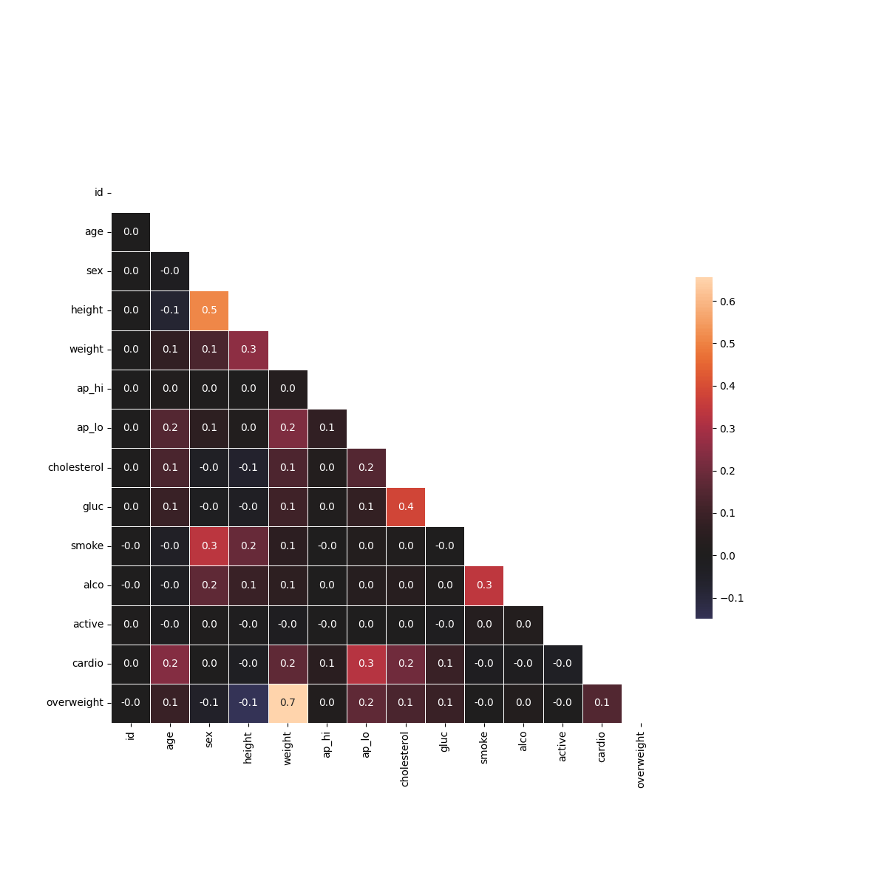

Medical Data Visualizer
Project 3: Data Analysis with Python Certification - FreeCodeCamp

Project Overview:
This is my third project for the FreeCodeCamp Data Analysis with Python certification. The goal was to visualize and examine medical examination data to find relationships between cardiac disease, body measurements, blood markers, and lifestyle choices.

Key Objectives
1. Feature Engineering: Created an overweight column by calculating BMI (weight/height²) and determined if a patient is overweight (BMI > 25).

2. Data Normalization: Standardized cholesterol and gluc levels; if the value was 1, it was set to 0 (good), and if it was > 1, it was set to 1 (bad).

3. Data Cleaning: Filtered out patient records where diastolic pressure was higher than systolic, and removed height/weight outliers outside the 2.5th and 97.5th percentiles.

The Process
Categorical Plot: I used pd.melt to convert the data into a long format, then used sns.catplot to show the counts of good/bad outcomes for various health features, split by cardiovascular health status.

Heat Map: I calculated a correlation matrix using the cleaned data. I applied a mask to hide the upper triangle of the matrix to create a cleaner, more readable correlation heat map using sns.heatmap.

Tools Used:
1. Python

2. Pandas for data manipulation

3. Seaborn and Matplotlib for data visualization

4. NumPy for mathematical operations

Final Visualizations
1. Categorical Plot
2. Correlation Heat Map
## Final Visualizations

### Categorical Plot

### Heat Map

